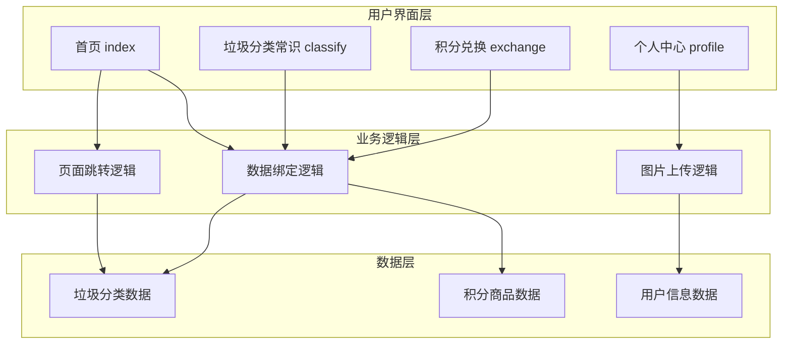
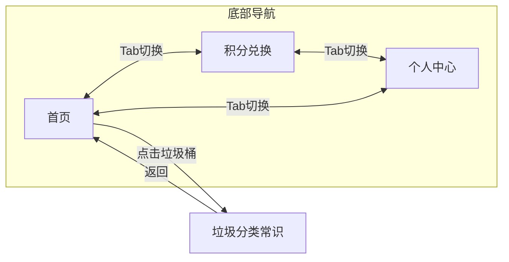

# 垃圾分类小程序 - 项目设计文档

## 一、系统架构



## 二、页面流程图



## 三、数据结构设计

### 3.1 垃圾分类数据

```javascript
// 四种垃圾分类
const trashTypes = [
  {
    id: 1,
    name: '可回收物',
    englishName: 'Recyclable',
    icon: '/images/recyclable.png',
    color: '#4A90D9',
    bgColor: 'rgba(74, 144, 217, 0.1)',
    description: '可回收物是指适宜回收利用和资源化利用的生活废弃物',
    examples: ['废纸张', '废塑料', '废玻璃', '废金属', '废织物'],
    tips: '投放前请清空内容物，保持清洁干燥'
  },
  {
    id: 2,
    name: '有害垃圾',
    englishName: 'Harmful',
    icon: '/images/harmful.png',
    color: '#E85D5D',
    bgColor: 'rgba(232, 93, 93, 0.1)',
    description: '有害垃圾是指对人体健康或自然环境造成直接或潜在危害的废弃物',
    examples: ['废电池', '废灯管', '废药品', '废油漆', '废杀虫剂'],
    tips: '投放时请注意轻放，避免破损'
  },
  {
    id: 3,
    name: '厨余垃圾',
    englishName: 'Kitchen',
    icon: '/images/kitchen.png',
    color: '#5BBD72',
    bgColor: 'rgba(91, 189, 114, 0.1)',
    description: '厨余垃圾是指居民日常生活及食品加工等过程中产生的废弃物',
    examples: ['剩菜剩饭', '果皮果核', '蛋壳', '茶渣', '菜叶'],
    tips: '投放前请沥干水分，去除包装物'
  },
  {
    id: 4,
    name: '其他垃圾',
    englishName: 'Other',
    icon: '/images/other.png',
    color: '#8E8E93',
    bgColor: 'rgba(142, 142, 147, 0.1)',
    description: '其他垃圾是指除可回收物、有害垃圾、厨余垃圾以外的其他生活废弃物',
    examples: ['卫生纸', '烟蒂', '陶瓷碎片', '一次性餐具', '尘土'],
    tips: '尽量沥干水分后投放'
  }
]
```

### 3.2 积分商品数据

```javascript
// 积分兑换商品
const exchangeGoods = [
  { id: 1, name: '环保购物袋', points: 100, image: '...', stock: 50 },
  { id: 2, name: '便携餐具套装', points: 200, image: '...', stock: 30 },
  { id: 3, name: '保温杯', points: 500, image: '...', stock: 20 },
  // ...
]
```

### 3.3 用户数据

```javascript
// 用户信息
const userInfo = {
  avatarUrl: '',      // 头像URL
  nickName: '环保达人', // 昵称
  points: 1280,       // 积分
  level: 3,           // 等级
  joinDate: '2024-01-01' // 加入日期
}
```

## 四、UI/UX 设计规范

### 4.1 设计风格：轻透清新风

**核心特征：**
- 大面积留白，呼吸感强
- 浅色渐变背景，营造通透感
- 毛玻璃效果卡片
- 柔和的圆角和阴影
- 清新的配色方案

### 4.2 色彩体系

| 用途 | 色值 | 说明 |
|------|------|------|
| 主色调 | #5BBD72 | 清新绿，环保主题 |
| 渐变起始 | #E8F5E9 | 浅绿渐变起点 |
| 渐变结束 | #F0F9FF | 浅蓝渐变终点 |
| 可回收物 | #4A90D9 | 天空蓝 |
| 有害垃圾 | #E85D5D | 珊瑚红 |
| 厨余垃圾 | #5BBD72 | 清新绿 |
| 其他垃圾 | #8E8E93 | 中性灰 |
| 页面背景 | #F7FAF8 | 极浅灰绿 |
| 卡片背景 | rgba(255,255,255,0.7) | 半透明白 |
| 主文字 | #2D3436 | 深灰 |
| 次文字 | #636E72 | 中灰 |
| 辅助文字 | #B2BEC3 | 浅灰 |

### 4.3 间距规范

| 类型 | 尺寸 | 用途 |
|------|------|------|
| 页面边距 | 32rpx | 页面左右边距 |
| 卡片间距 | 24rpx | 卡片之间间距 |
| 内容间距 | 16rpx | 卡片内部元素间距 |
| 小间距 | 8rpx | 紧凑元素间距 |

### 4.4 圆角规范

| 类型 | 尺寸 | 用途 |
|------|------|------|
| 大圆角 | 24rpx | 卡片、大按钮 |
| 中圆角 | 16rpx | 小卡片、输入框 |
| 小圆角 | 8rpx | 标签、小按钮 |
| 圆形 | 50% | 头像、图标背景 |

### 4.5 阴影规范

```css
/* 轻盈阴影 - 卡片默认 */
box-shadow: 0 4rpx 20rpx rgba(91, 189, 114, 0.08);

/* 悬浮阴影 - 交互反馈 */
box-shadow: 0 8rpx 30rpx rgba(91, 189, 114, 0.15);

/* 毛玻璃效果 */
background: rgba(255, 255, 255, 0.7);
backdrop-filter: blur(20rpx);
```

## 五、页面设计详情

### 5.1 首页 (index)

**布局结构：**
1. 顶部轮播图区域 (swiper)
2. 快捷功能入口区域
3. 四种垃圾分类卡片 (wx:for)

**交互设计：**
- 轮播图自动播放，支持手动滑动
- 垃圾分类卡片点击有轻微缩放反馈
- 点击卡片跳转到对应分类详情页

### 5.2 垃圾分类常识页 (classify)

**布局结构：**
1. 顶部分类标题和图标
2. 分类说明卡片
3. 常见垃圾列表
4. 投放提示

**交互设计：**
- 根据传入的分类ID显示对应内容
- 列表支持滚动

### 5.3 积分兑换页 (exchange)

**布局结构：**
1. 用户积分展示区
2. 热门活动轮播 (swiper)
3. 商品列表 (scroll-view)

**交互设计：**
- 商品列表支持纵向滚动
- 兑换按钮有loading状态
- 积分不足时按钮置灰

### 5.4 个人中心页 (profile)

**布局结构：**
1. 用户信息卡片（头像、昵称、积分）
2. 功能菜单列表 (weui-cells)
3. 设置选项

**交互设计：**
- 点击头像可更换（本地上传）
- 菜单项有点击反馈

## 六、考核要点实现对照

| 考核要点 | 实现文件 | 实现方式 |
|----------|----------|----------|
| 底部tab配置 | app.json | tabBar配置3个页面 |
| window导航配置 | app.json | navigationBar配置 |
| swiper轮播图 | index.wxml, exchange.wxml | swiper组件 |
| view/image标签 | 所有页面 | 基础组件使用 |
| bindtap事件 | index.js | goToClassify函数 |
| wx:for数据绑定 | index.wxml | 垃圾桶列表渲染 |
| 页面参数传递 | classify.js | onLoad接收options |
| scroll-view组件 | exchange.wxml | 商品列表滚动 |
| weUI框架 | profile.wxml | weui-cells组件 |
| 头像上传 | profile.js | wx.chooseImage |
